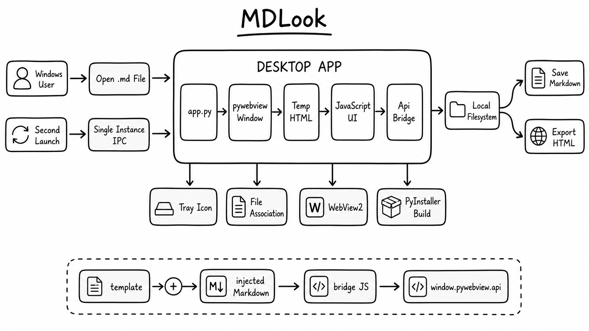

# Links and Images Repro

## Target 

[Linked note](linked-note.md#target)

[Project file](../app.py)

[External site](https://pywebview.flowrl.com/3.7/guide/usage)

[Back to target](#local-target)

